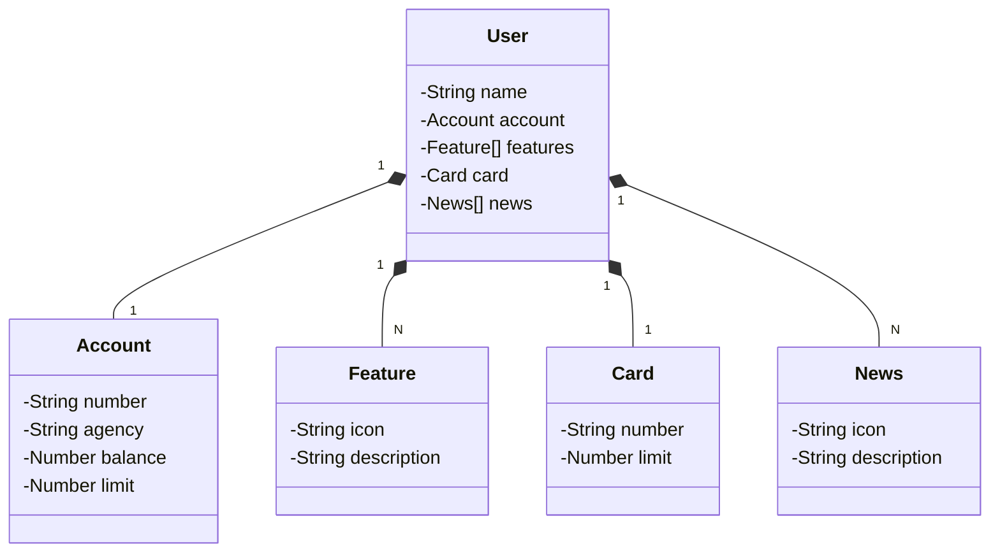

# santander-dev-week-2024
Java RESTful API criada para a Santander Dev Week 2024

## Etapas:  

**Criação e Versionamento da API**

- Spring Initializr e GitHub

**Abstração e Modelagem do Domínio**

- Figma, chatGPT (Mermaid) e JPA

Diagrama de classes do projeto

**Implementação do Backend**

- Spring Boot e Java 21

**Deploy e Monitoramento**

- Railway (PostgreSQL e CI/CD da API)

## Criação e Importação do Projeto

> [spring initializr](https://start.spring.io/) - [configuation](https://start.spring.io/#!type=maven-project&language=java&platformVersion=3.3.2&packaging=jar&jvmVersion=21&groupId=me-dio&artifactId=santander-dev-week-2024&name=santander-dev-week-2024&description=Java%20RESTful%20API%20criada%20para%20a%20Santander%20Dev%20Week%202024&packageName=me-dio&dependencies=web,data-jpa,h2,postgresql)
